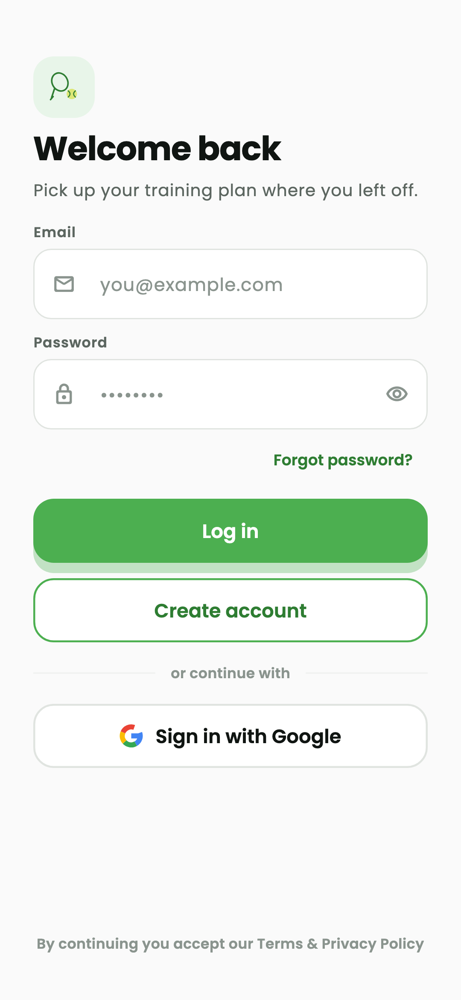

# AceCoach 🎾 — login screen

Branch `login-only`: the sign-in screen and Firebase email/password
authentication. Everything else (home, session setup, AI generation, history,
profile, OpenWeatherMap) has been removed and is added back step by step.

<p align="center">
  
</p>

## What is in

- Email and password sign-in through Firebase Authentication.
- Inline validation, show / hide password, failures mapped to plain messages.
- "Forgot password?" bottom sheet sending a real reset email.
- A bare signed-in screen with a Sign out button, so the full cycle is testable
  while the real home screen is not back yet.
- Material 3 light and dark themes, Poppins bundled, safe-area aware.

## Quick start

`flutter run` works on a fresh clone, on any machine, with nothing to fill in.

```bash
flutter pub get
flutter run
```

Without Firebase keys the app still starts and the login screen still renders;
signing in then reports that Firebase is not configured. Without a weather key
the home screen loads and only the weather chip shows its error state. Nothing
blocks.

### Weather key

The OpenWeatherMap key is a real secret, unlike the Firebase ones, so it is
never committed. Put it in a git-ignored `.env` at the repository root:

```
OPENWEATHER_API_KEY=your_key
```

and pass it at build time — the file is read by the toolchain, not bundled as
an asset, so its absence never breaks the build:

```bash
flutter run --dart-define-from-file=.env
```

Get a key at <https://home.openweathermap.org/api_keys> (activation takes up to
two hours).

## Firebase

Configuration lives in the platform files, committed with the code:

| Platform | File |
|---|---|
| Android | `android/app/google-services.json` |
| iOS | `ios/Runner/GoogleService-Info.plist` |

`Firebase.initializeApp()` reads them at start-up — there is no
`firebase_options.dart` and no environment variable. On Android the
`com.google.gms.google-services` Gradle plugin does the reading; it is applied
only when the JSON is present, so a clone without it still builds.

Committing these files is intentional. Client API keys are not secrets: they
ship inside every build of the app, and Google documents committing
`google-services.json`. Access is controlled by Firebase Security Rules and by
the key restrictions set in the Google Cloud console.

To point the app at a project:

1. <https://console.firebase.google.com> → **Add project**.
2. **Authentication → Sign-in method** → enable **Email/Password**.
3. **Project settings → Your apps → Add app → Android**, package name
   `com.acecoach.ace_coach`. Download `google-services.json` into
   `android/app/`.
4. For iOS, bundle id `com.acecoach.aceCoach`, and drop
   `GoogleService-Info.plist` into `ios/Runner/` through Xcode.

Quality gates:

```bash
flutter analyze   # zero issues
flutter test
```

## Project layout

```
lib/
├── constants/          colour, spacing and theme tokens
├── models/             AppUser, AuthFailure
├── services/           AuthService (Firebase Authentication)
├── repositories/       AuthRepository (exceptions → AuthFailure)
├── providers/          Riverpod providers and the auth controller
├── screens/auth/       login_screen.dart + its form widgets
├── screens/home/       signed_in_screen.dart (placeholder landing page)
├── widgets/            app_logo.dart, primary_button.dart
├── app.dart            MaterialApp, themes, AuthGate
└── main.dart           entry point, Firebase start-up
```

Architecture: `screens → providers → repositories → services`, as on `master`.

## Licence

Poppins is bundled under the SIL Open Font License (`assets/google_fonts/OFL.txt`).
