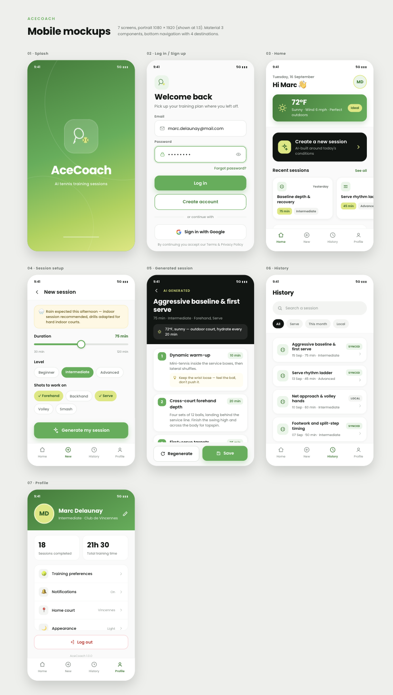

# AceCoach 🎾

AI-built tennis training sessions, adapted to your level, your strokes and
today's weather. Flutter + Riverpod + Firebase.

---

## Run it

### 1. Prerequisites

Flutter **3.35+** (Dart SDK 3.13+) and an Android device or emulator.

```bash
flutter --version
flutter doctor
```

### 2. Get the setup zip

Two files are deliberately **not** in this repository: the Firebase config and
the OpenWeatherMap key. They are sent separately, outside GitHub, as
`acecoach-setup.zip`.

Unzip it and drop both items into the root of your clone, keeping the folder
structure:

```
ace_coach/
├── .env                              ← OpenWeatherMap key
└── android/app/google-services.json  ← Firebase (Auth + AI)
```

> **macOS:** the Finder hides `.env`. Press <kbd>⌘</kbd><kbd>⇧</kbd><kbd>.</kbd>
> to reveal it, or copy it from the terminal.

Both paths are already in `.gitignore`, so they can never be committed back by
accident.

### 3. Launch

```bash
flutter pub get
flutter run --dart-define-from-file=.env
```

That's it. Without the zip the app still builds and runs — sign-in reports that
Firebase is not configured, the weather chip shows its error state, and session
generation is unavailable. Nothing crashes.

---

## Demo

https://github.com/DimitriZindovic/AceCoach/raw/main/docs/acecoach-demo.mp4

<sub>Or open [`docs/acecoach-demo.mp4`](docs/acecoach-demo.mp4).</sub>

## Design

Seven screens, Material 3, bottom navigation with four destinations.



---

## What it does

- **Firebase email/password auth** — sign up, sign in, password reset, inline
  validation and failures mapped to plain-language messages.
- **Weather-aware home** — current conditions from OpenWeatherMap at your
  location, with an indoor/outdoor verdict.
- **AI session generation** — pick a duration, a level and the strokes to work
  on; Firebase AI Logic returns a structured plan (warm-up, drills, coaching
  cues) adjusted to the forecast.
- **History** — sessions are saved locally and searchable, so the app stays
  usable offline.
- **Profile** — training stats, preferences, sign out.

## How it's built

```
lib/
├── constants/     colour, spacing, theme and API tokens
├── models/        AppUser, TrainingSession, Exercise, Weather, SessionParams
├── services/      Firebase Auth, Firebase AI, OpenWeatherMap, geolocation,
│                  local JSON store
├── repositories/  exceptions → typed failures
├── providers/     Riverpod controllers (auth, weather, session, history)
├── screens/       splash, auth, home, session setup, result, history, profile
├── widgets/       shared UI components
├── router/        go_router shell and routes
└── app.dart       MaterialApp, themes, auth gate
```

Architecture is one-way: `screens → providers → repositories → services`.
Sessions are persisted as a JSON file via `path_provider` — no database engine,
no code generation step to run before building.

| | |
|---|---|
| State | `flutter_riverpod` + `riverpod_generator` |
| Navigation | `go_router` |
| Backend | `firebase_auth`, `firebase_ai` |
| HTTP | `dio` |
| Platform | Android (`com.acecoach.ace_coach`) |

Quality gates:

```bash
flutter analyze
```

## Notes on configuration

`google-services.json` is read at start-up by the
`com.google.gms.google-services` Gradle plugin, which is applied only when the
file is present — that is why a clone without it still builds. The
OpenWeatherMap key is read through `String.fromEnvironment`, so it is injected
at build time by `--dart-define-from-file` and never bundled as an asset.

Need your own keys instead? Create a Firebase project, enable
**Authentication → Email/Password** and **Firebase AI Logic**, add an Android
app with package name `com.acecoach.ace_coach`, and download its
`google-services.json` into `android/app/`. Then put your own key from
[openweathermap.org](https://home.openweathermap.org/api_keys) into `.env` as
`OPENWEATHER_API_KEY=…` (activation can take up to two hours).

## Licence

Poppins is bundled under the SIL Open Font License
(`assets/google_fonts/OFL.txt`).
