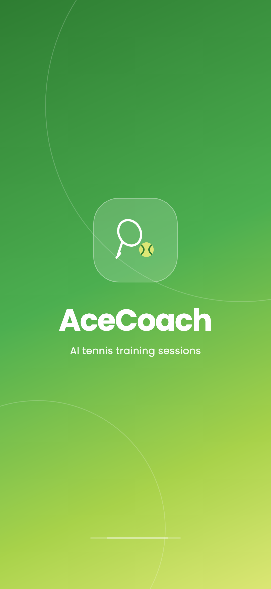
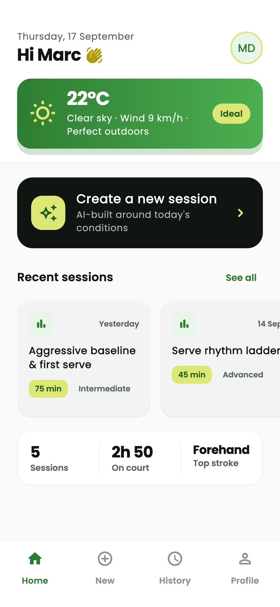
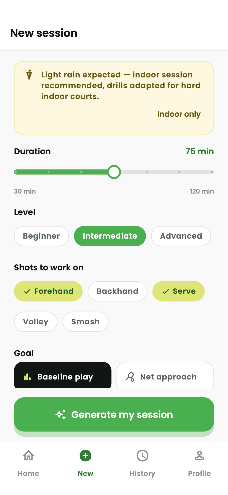
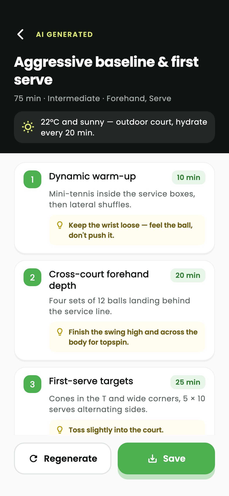
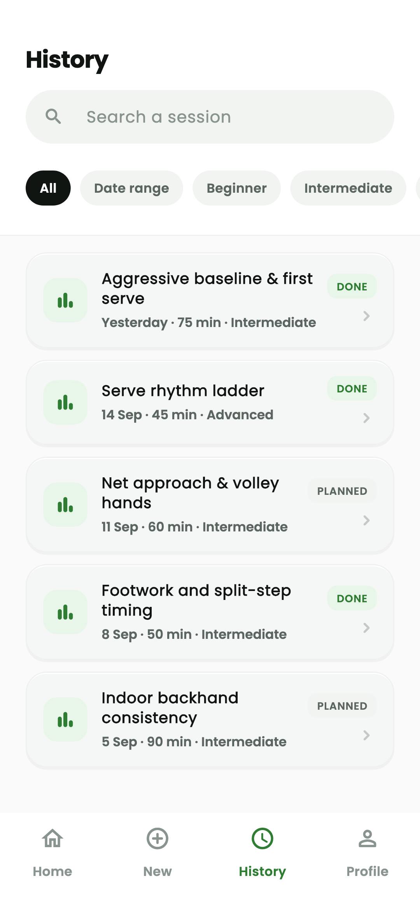
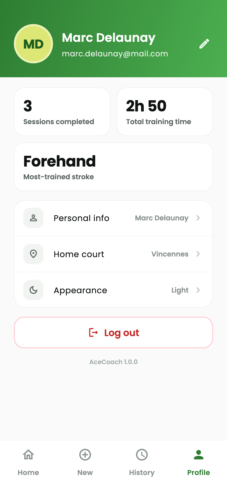
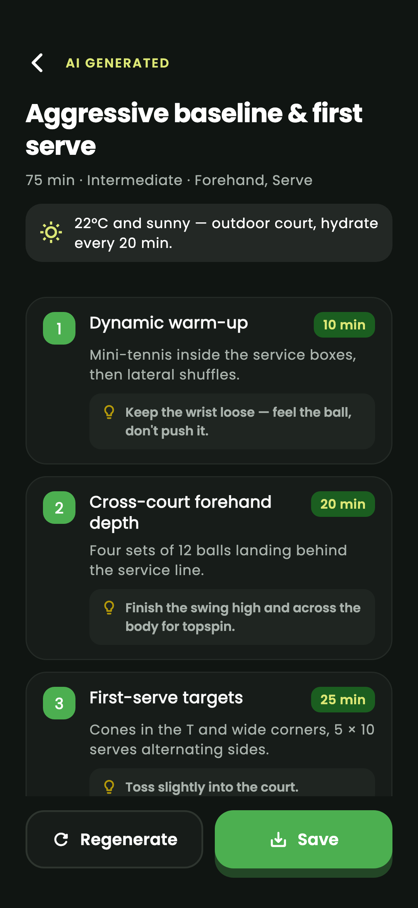

# AceCoach 🎾

**AI tennis training sessions that adapt to today's weather.**

AceCoach builds a complete, timed training plan from what you want to work on
— duration, level, strokes, tactical goal, who is on court — and the weather at
your court. Plans are generated by Gemini with structured JSON output, saved on
the device and readable offline.

<p align="center">
  
  
  
  
</p>
<p align="center">
  
  
  
  
</p>

## Features

- **Accounts** — email/password and Google sign-in with Firebase
  Authentication, password reset, friendly validation messages, auth-guarded
  routes.
- **Guided setup** — 30 to 120 minutes in 15-minute steps, level, multi-select
  strokes, tactical goal, players present, optional "indoor court only".
- **Weather-aware** — OpenWeatherMap from the device position (or a chosen
  city when location is denied). Rain, wind, heat or cold change the plan and
  trigger a non-blocking banner offering an indoor version. A weather failure
  never blocks generation.
- **AI generation** — Gemini through Firebase AI Logic with an enforced JSON
  schema; durations validated against the request; Regenerate with a visible
  loading state; distinct network / quota / malformed errors with retry.
- **Offline history** — save any plan locally (drift / SQLite), search by
  keyword, filter by level, stroke and date range, mark as completed, delete
  with confirmation.
- **Profile** — completed sessions, cumulative training time, most-trained
  stroke, home court, light / dark / system theme, sign out.
- **Design** — Material 3, light and dark themes, Poppins, tokens extracted
  from the Claude Design mockup, safe-area aware, 48 dp tap targets, semantic
  labels.

## Stack

| Concern | Package |
|---|---|
| State | `flutter_riverpod` 3 + `riverpod_annotation` / `riverpod_generator` / `riverpod_lint` |
| Navigation | `go_router` 18 (stateful shell, redirect guard) |
| Auth | `firebase_core`, `firebase_auth`, `google_sign_in` 7 |
| AI | `firebase_ai` (Gemini, structured output) |
| HTTP | `dio` |
| Models | `freezed`, `json_serializable` |
| Local DB | `drift` + `drift_flutter` |
| Misc | `flutter_dotenv`, `geolocator`, `google_fonts`, `intl`, `uuid` |
| Tests | `flutter_test`, `mocktail` |

Architecture: `screens/widgets → providers → repositories → services`. See
[`docs/architecture.md`](docs/architecture.md), [`docs/api_contracts.md`](docs/api_contracts.md)
and [`docs/setup_guide.md`](docs/setup_guide.md).

## Quick start

```bash
git clone <repository-url> ace_coach && cd ace_coach
flutter pub get
cp .env.example .env        # then fill in Firebase + OpenWeatherMap values
flutter run
```

Quality gates:

```bash
flutter analyze   # zero issues
flutter test      # unit + widget tests
```

## Project layout

```
lib/
├── constants/     tokens (colours, spacing, themes) and API constants
├── models/        freezed models: SessionParams, Exercise, Weather, TrainingSession, AppUser, failures
├── services/      Firebase Auth, OpenWeatherMap (dio), Gemini (firebase_ai), geolocator, drift
├── repositories/  auth, weather, session (AI + local history)
├── providers/     Riverpod code-generated providers and notifiers
├── router/        go_router configuration + bottom-navigation shell
├── screens/       auth, home, session_setup, session_result, history, profile
└── widgets/       buttons, cards, chips, slider, overlay, empty state…
```

## Licence

Poppins is bundled under the SIL Open Font License (`assets/google_fonts/OFL.txt`).
